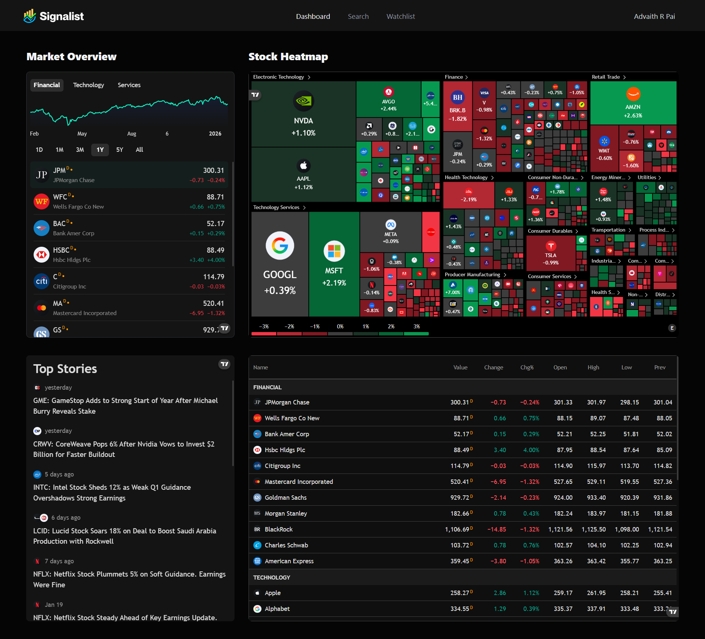
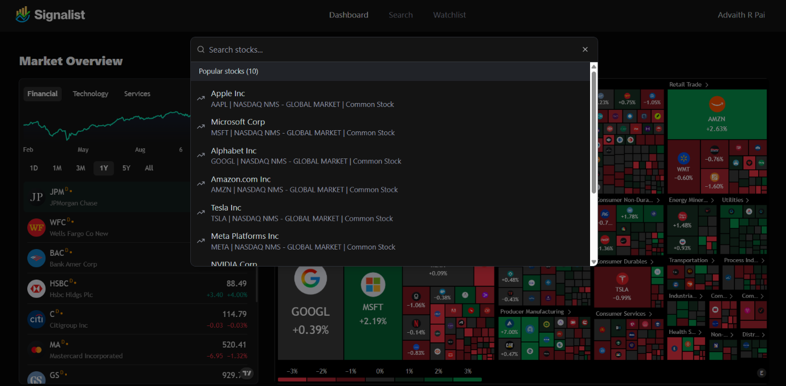
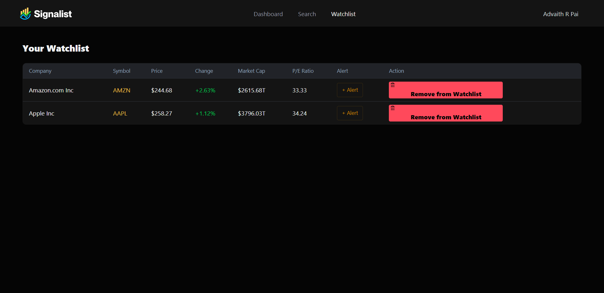
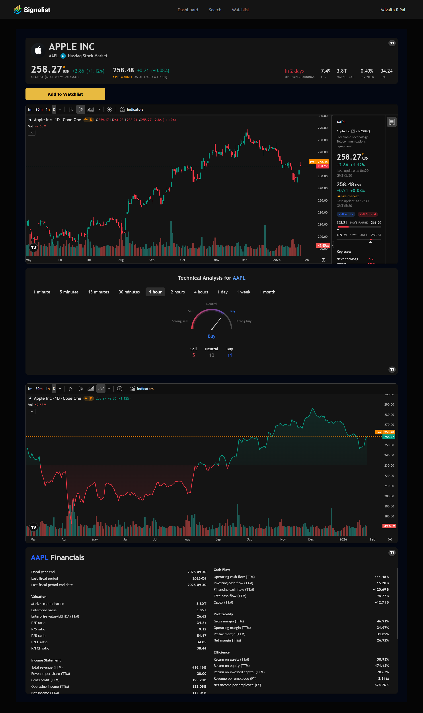
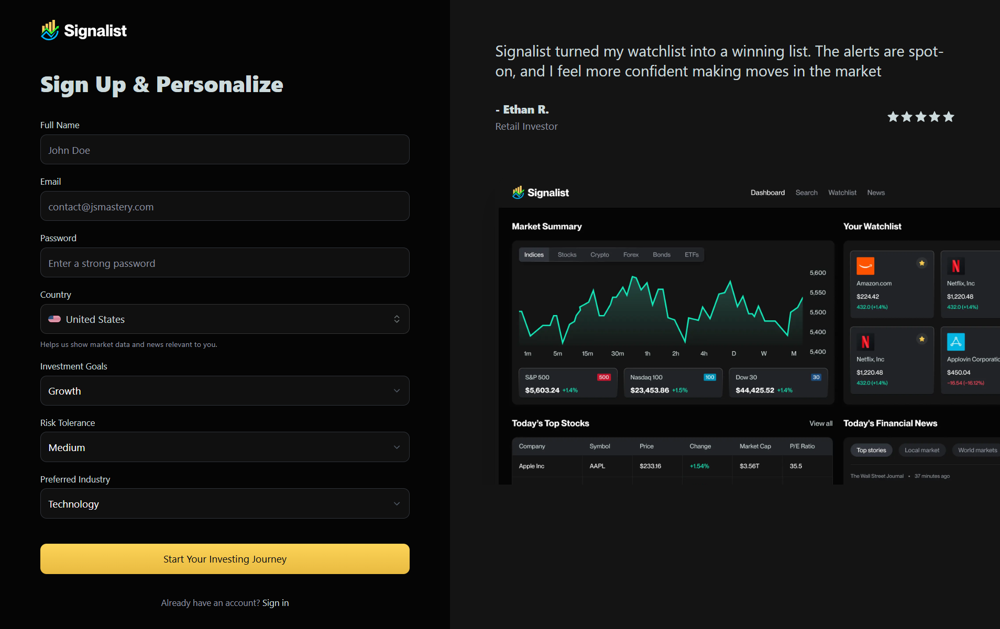
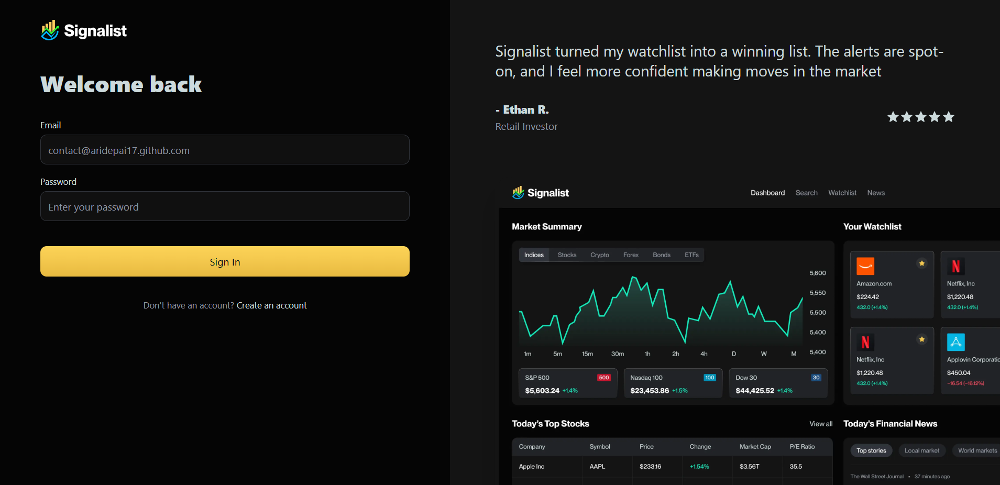
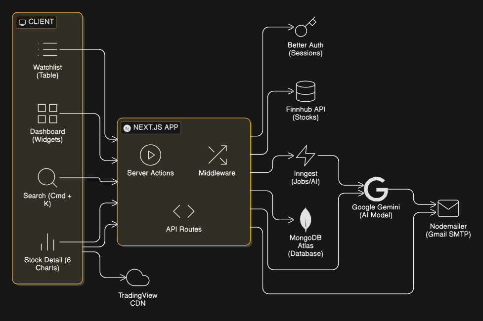

<div align="center">

# Signalist

### Real-Time Stock Market Intelligence Platform

Track real-time stock prices, build personalized watchlists, get AI-powered market insights, and receive daily news summaries - all in one sleek, dark-themed dashboard.

[](https://nextjs.org/)
[](https://www.typescriptlang.org/)
[](https://www.mongodb.com/atlas)
[](https://tailwindcss.com/)
[](https://vercel.com/)

</div>

---

<!-- SCREENSHOT: Full dashboard view -->
<!--  -->

## Table of Contents

- [About](#about)
- [Features](#features)
- [Screenshots](#screenshots)
- [Tech Stack](#tech-stack)
- [Architecture](#architecture)
- [Getting Started](#getting-started)
  - [Prerequisites](#prerequisites)
  - [Installation](#installation)
  - [Environment Variables](#environment-variables)
  - [Running Locally](#running-locally)
- [Project Structure](#project-structure)
- [Core Modules](#core-modules)
  - [Authentication](#authentication)
  - [Stock Search & Discovery](#stock-search--discovery)
  - [Watchlist Management](#watchlist-management)
  - [Stock Details](#stock-details)
  - [Dashboard Widgets](#dashboard-widgets)
  - [AI-Powered Email Notifications](#ai-powered-email-notifications)
- [API Integrations](#api-integrations)
- [Database Schema](#database-schema)
- [Deployment](#deployment)
- [Contributing](#contributing)
- [License](#license)

---

## About

**Signalist** is a full-stack stock market intelligence platform designed for retail investors who want a centralized hub for market data, personal watchlists, and AI-driven insights. Instead of juggling multiple tabs and services, Signalist brings together live charts, company fundamentals, personalized alerts, and daily AI-generated market summaries into a single, cohesive experience.

Whether you're a growth investor tracking tech stocks or a conservative investor monitoring blue-chip dividends, Signalist adapts to your investment profile and delivers the information that matters to you.

### Who is this for?

- **Retail Investors** looking for a clean, all-in-one market dashboard
- **Day Traders** who need quick access to live charts and technical analysis
- **Passive Investors** who want daily summaries without constant monitoring
- **Students & Learners** exploring stock markets with real data

---

## Features

### Real-Time Market Dashboard
A four-widget dashboard powered by TradingView showing market overview, sector heatmaps, top stories, and major index quotes - all updating in real time.



### Stock Search (Cmd/Ctrl + K)
Instant stock search via a command palette. Type any symbol or company name and get results from Finnhub's global database. Results show symbol, company name, exchange, stock type, and whether the stock is already in your watchlist.



### Personalized Watchlist
Add any stock to your watchlist with one click. The watchlist page enriches each entry with live data - current price, daily change percentage, market capitalization, and P/E ratio - all fetched from Finnhub in real time.



### Stock Detail Pages
Each stock gets a dedicated page with six TradingView widgets: symbol info, advanced candlestick chart, technical analysis indicators, company profile, baseline chart, and financials breakdown.



### User Authentication & Onboarding
Full email/password authentication with a profile-based onboarding flow. During sign-up, users specify their country, investment goals, risk tolerance, and preferred industry - data that powers personalized AI features.





### AI-Powered Email Notifications
- **Welcome Email** - On sign-up, Google Gemini generates a personalized introduction based on the user's investment profile
- **Daily News Summary** - A scheduled job fetches news for each user's watchlist, sends the articles to Gemini for summarization, and delivers a formatted HTML email every day at 12:00 PM UTC

---

## Screenshots

> Replace the placeholders below with actual screenshots of your application.

| Screen | Preview |
|--------|---------|
| **Dashboard** | <!--  --> `screenshots/dashboard.png` |
| **Sign Up** | <!--  --> `screenshots/sign-up.png` |
| **Sign In** | <!--  --> `screenshots/sign-in.png` |
| **Stock Search** | <!--  --> `screenshots/stock-search.png` |
| **Stock Details** | <!--  --> `screenshots/stock-details.png` |
| **Watchlist** | <!--  --> `screenshots/watchlist.png` |
| **Email Notification** | <!--  --> `screenshots/email-notification.png` |

---

## Tech Stack

| Layer | Technology | Purpose |
|-------|-----------|---------|
| **Framework** | Next.js 15 (App Router) | Server components, routing, API routes |
| **Language** | TypeScript 5 | Type safety across the entire codebase |
| **UI Library** | React 19 | Component-based user interface |
| **Styling** | Tailwind CSS 4 | Utility-first CSS with custom dark theme |
| **Components** | Radix UI + Shadcn/ui | Accessible, composable UI primitives |
| **Forms** | React Hook Form | Performant form handling with validation |
| **Notifications** | Sonner | Toast notifications |
| **Authentication** | Better Auth | Session-based email/password auth |
| **Database** | MongoDB Atlas + Mongoose | Cloud-hosted NoSQL database |
| **Stock Data** | Finnhub API | Quotes, search, company profiles, news |
| **Charts** | TradingView Widgets | Embedded financial charts and analysis |
| **Task Queue** | Inngest | Serverless background jobs and cron |
| **AI** | Google Gemini 2.5 Flash | Personalized content generation |
| **Email** | Nodemailer (Gmail SMTP) | Transactional email delivery |
| **Deployment** | Vercel | Serverless hosting with edge network |
| **Build Tool** | Turbopack | Fast development builds |

---

## Architecture

```
┌─────────────────────────────────────────────────────────────┐
│                        Client (Browser)                     │
│                                                             │
│  ┌──────────┐  ┌──────────┐  ┌──────────┐  ┌────────────┐   │
│  │Dashboard │  │  Search  │  │Watchlist │  │Stock Detail│   │
│  │(Widgets) │  │(Cmd + K) │  │ (Table)  │  │ (6 Charts) │   │
│  └──────────┘  └──────────┘  └──────────┘  └────────────┘   │
│        │              │             │              │        │
│        └──────────────┴─────────────┴──────────────┘        │
│                           │                                 │
│                    TradingView CDN                          │
└───────────────────────────┬─────────────────────────────────┘
                            │
                    ┌───────▼────────┐
                    │   Next.js App  │
                    │  (App Router)  │
                    │                │
                    │ Server Actions │
                    │  Middleware    │
                    │  API Routes    │
                    └──┬────┬────┬───┘
                       │    │    │
            ┌──────────┘    │    └──────────┐
            │               │               │
    ┌───────▼──────┐  ┌─────▼──────┐ ┌──────▼──────┐
    │  Better Auth │  │ Finnhub API│ │   Inngest   │
    │  (Sessions)  │  │  (Stocks)  │ │  (Jobs/AI)  │
    └───────┬──────┘  └────────────┘ └──────┬──────┘
            │                               │
    ┌───────▼──────┐                ┌───────▼──────┐
    │MongoDB Atlas │                │ Google Gemini│
    │  (Database)  │                │  (AI Model)  │
    └──────────────┘                └───────┬──────┘
                                            │
                                    ┌───────▼──────┐
                                    │  Nodemailer  │
                                    │ (Gmail SMTP) │
                                    └──────────────┘
```



---

## Getting Started

### Prerequisites

- **Node.js** 18.17 or later
- **npm** 9 or later
- A **MongoDB Atlas** cluster ([create one free](https://www.mongodb.com/cloud/atlas/register))
- A **Finnhub** API key ([register free](https://finnhub.io/register))
- A **Google Gemini** API key ([get one](https://aistudio.google.com/apikey))
- A **Gmail App Password** for email delivery ([how to create](https://support.google.com/accounts/answer/185833))
- (Optional) An **Inngest** account for background job management ([sign up](https://www.inngest.com/))

### Installation

```bash
# Clone the repository
git clone https://github.com/aridepai17/SIGNALIST.git

# Navigate to the project directory
cd SIGNALIST/realtimestockmarket

# Install dependencies
npm install
```

### Environment Variables

Create a `.env` file in the `realtimestockmarket` directory with the following variables:

```env
# App
NODE_ENV=development
NEXT_PUBLIC_BASE_URL=http://localhost:3000

# MongoDB
MONGODB_URI=mongodb+srv://<username>:<password>@<cluster>.mongodb.net/?appName=<app>

# Authentication (Better Auth)
BETTER_AUTH_SECRET=<generate-a-random-secret-string>
BETTER_AUTH_URL=http://localhost:3000

# Finnhub Stock API
FINNHUB_API_KEY=<your-finnhub-api-key>

# Google Gemini AI
GEMINI_API_KEY=<your-gemini-api-key>

# Email (Gmail SMTP via Nodemailer)
NODEMAILER_EMAIL=<your-gmail@gmail.com>
NODEMAILER_PASSWORD=<your-gmail-app-password>
```

| Variable | Required | Description |
|----------|----------|-------------|
| `MONGODB_URI` | Yes | MongoDB Atlas connection string |
| `BETTER_AUTH_SECRET` | Yes | Random string used to sign session tokens |
| `BETTER_AUTH_URL` | Yes | Base URL of the application |
| `FINNHUB_API_KEY` | Yes | API key from Finnhub for stock data |
| `GEMINI_API_KEY` | Yes | Google Gemini API key for AI features |
| `NODEMAILER_EMAIL` | Yes | Gmail address for sending emails |
| `NODEMAILER_PASSWORD` | Yes | Gmail App Password (not your regular password) |
| `NEXT_PUBLIC_BASE_URL` | Yes | Public-facing base URL |

> **Note:** For `BETTER_AUTH_SECRET`, you can generate a secure random string with:
> ```bash
> openssl rand -base64 32
> ```

### Running Locally

```bash
# Start the development server (with Turbopack)
npm run dev
```

Open [http://localhost:3000](http://localhost:3000) in your browser.

To run Inngest functions locally (email jobs, cron tasks):

```bash
# In a separate terminal
npx inngest-cli@latest dev
```

---

## Project Structure

```
realtimestockmarket/
│
├── app/                           # Next.js App Router
│   ├── (auth)/                    # Auth route group (public)
│   │   ├── layout.tsx             #   Auth layout with session redirect
│   │   ├── sign-in/page.tsx       #   Sign-in form
│   │   └── sign-up/page.tsx       #   Sign-up form with profile onboarding
│   ├── (root)/                    # Protected route group
│   │   ├── layout.tsx             #   Root layout with auth guard & header
│   │   ├── page.tsx               #   Dashboard (TradingView widgets)
│   │   ├── watchlist/page.tsx     #   Watchlist table with live data
│   │   └── stocks/[symbol]/       #   Stock detail page
│   │       └── page.tsx           #     Symbol-specific charts & info
│   ├── api/inngest/route.ts       # Inngest webhook handler
│   ├── layout.tsx                 # Root HTML layout (fonts, metadata)
│   └── globals.css                # Global styles & CSS variables
│
├── components/
│   ├── forms/                     # Form field components
│   │   ├── InputField.tsx         #   Text/password input with validation
│   │   ├── SelectField.tsx        #   Dropdown select with options
│   │   ├── CountrySelectField.tsx #   Country picker with flag icons
│   │   └── FooterLink.tsx         #   "Don't have an account?" link
│   ├── ui/                        # Shadcn/ui base components
│   │   ├── button.tsx
│   │   ├── dialog.tsx
│   │   ├── dropdown-menu.tsx
│   │   ├── input.tsx
│   │   ├── table.tsx
│   │   └── ...
│   ├── Header.tsx                 # App header with nav, search, user menu
│   ├── NavItems.tsx               # Navigation links
│   ├── SearchCommand.tsx          # Cmd+K search modal
│   ├── TradingViewWidget.tsx      # Generic TradingView widget renderer
│   ├── WatchlistButton.tsx        # Add/remove from watchlist toggle
│   ├── WatchlistTable.tsx         # Watchlist data table
│   └── UserDropdown.tsx           # User avatar & dropdown menu
│
├── database/
│   ├── models/
│   │   └── watchlist.model.ts     # Mongoose watchlist schema
│   └── mongoose.ts                # MongoDB connection singleton
│
├── hooks/
│   ├── useDebounce.ts             # Debounce hook for search input
│   └── useTradingViewWidget.tsx   # TradingView script loader hook
│
├── lib/
│   ├── actions/
│   │   ├── auth.actions.ts        # Sign-up, sign-in, sign-out server actions
│   │   ├── finnhub.actions.ts     # Stock search, news fetching
│   │   ├── watchlist.actions.ts   # Watchlist CRUD operations
│   │   └── user.actions.ts        # User queries for email notifications
│   ├── better-auth/
│   │   └── auth.ts                # Better Auth initialization
│   ├── inngest/
│   │   ├── client.ts              # Inngest client with Gemini AI step
│   │   ├── functions.ts           # Welcome email & daily news jobs
│   │   └── prompts.ts            # AI prompt templates
│   ├── nodemailer/
│   │   ├── index.ts               # Nodemailer transport setup
│   │   └── templates.ts           # HTML email templates
│   ├── constants.ts               # Popular stocks, TradingView configs
│   └── utils.ts                   # Date ranges, article formatting, cn()
│
├── middleware/
│   └── index.ts                   # Route protection middleware
│
├── types/
│   └── global.d.ts                # Global TypeScript type definitions
│
├── public/
│   └── assets/
│       ├── icons/                 # SVG icons (logo, star, nav icons)
│       └── images/                # Static images (dashboard preview)
│
├── .env                           # Environment variables (not committed)
├── next.config.ts                 # Next.js configuration
├── tailwind.config.js             # Tailwind CSS configuration
├── tsconfig.json                  # TypeScript configuration
├── components.json                # Shadcn/ui configuration
├── eslint.config.mjs              # ESLint 9 configuration
└── package.json                   # Dependencies and scripts
```

---

## Core Modules

### Authentication

Signalist uses [Better Auth](https://www.better-auth.com/) for session-based email/password authentication stored in MongoDB.

**How it works:**
1. User signs up with email, password, and profile details (country, goals, risk tolerance, industry)
2. Better Auth creates a user record in the `user` collection and issues a session cookie
3. Middleware on protected routes validates the session cookie before allowing access
4. Auth layouts redirect authenticated users away from `/sign-in` and `/sign-up`, and unauthenticated users away from protected pages

**Key files:**
- `lib/better-auth/auth.ts` — Auth instance initialization (lazy-loaded, cached)
- `lib/actions/auth.actions.ts` — Server actions for sign-up, sign-in, sign-out
- `middleware/index.ts` — Session cookie validation on protected routes
- `app/(auth)/layout.tsx` — Redirects logged-in users to dashboard
- `app/(root)/layout.tsx` — Redirects guests to sign-in

### Stock Search & Discovery

The search system uses Finnhub's symbol search API with intelligent caching and a command palette UI.

**How it works:**
1. User presses `Cmd/Ctrl + K` to open the search modal
2. Input is debounced (300ms) before firing a request
3. If the query is empty, the top 10 popular stocks are shown (profiles cached for 1 hour)
4. If a query is provided, Finnhub's `/search` endpoint returns matching symbols (cached for 30 minutes)
5. Each result is cross-referenced with the user's watchlist to show an "in watchlist" indicator

**Popular stocks library:** 80+ pre-configured symbols spanning US markets (AAPL, GOOGL, TSLA...), Indian markets (RELIANCE.NS, TCS.NS...), and Chinese markets (BABA, JD...).

**Key files:**
- `components/SearchCommand.tsx` — Command palette with debounced search
- `lib/actions/finnhub.actions.ts` — `searchStocks()` with caching
- `lib/constants.ts` — `POPULAR_STOCK_SYMBOLS` array

### Watchlist Management

Users can build a personal watchlist that persists across sessions and enriches each stock with live market data.

**How it works:**
1. User clicks the watchlist button on any stock (search results or detail pages)
2. Server action creates/removes a document in the `watchlist` collection
3. The watchlist page fetches all saved symbols and enriches each with three parallel Finnhub API calls:
   - `/quote` — Current price, daily change percentage
   - `/stock/profile2` — Company name, market capitalization
   - `/stock/metric` — P/E ratio and other financial metrics
4. Data is formatted for display (e.g., market cap as `$2.87T`, `$156.42B`, or `$892.31M`)

**Key files:**

- `lib/actions/watchlist.actions.ts` — CRUD operations + data enrichment
- `components/WatchlistButton.tsx` — Toggle button component
- `components/WatchlistTable.tsx` — Data table with live metrics
- `database/models/watchlist.model.ts` — Mongoose schema

### Stock Details

Each stock gets a dedicated page with six TradingView embedded widgets providing comprehensive market analysis.

**Widgets displayed:**

| Widget | Description |
|--------|-------------|
| Symbol Info | Current price, daily change, volume |
| Advanced Chart | Interactive candlestick chart with drawing tools |
| Technical Analysis | Buy/sell indicators and oscillators |
| Company Profile | Business description, sector, employees |
| Baseline Chart | Price performance against baseline |
| Financials | Revenue, earnings, balance sheet data |

**Symbol format handling:** Indian exchange symbols are automatically converted for TradingView compatibility (e.g., `RELIANCE.NS` becomes `NSE:RELIANCE`, `TCS.BO` becomes `BSE:TCS`).

**Key files:**

- `app/(root)/stocks/[symbol]/page.tsx` — Stock detail page
- `components/TradingViewWidget.tsx` — Generic widget renderer
- `hooks/useTradingViewWidget.tsx` — Script injection hook

### Dashboard Widgets

The main dashboard displays four TradingView widgets in a responsive grid layout.

| Widget | Content |
|--------|---------|
| Market Overview | Tabbed view of Financial, Technology, and Services sectors |
| Stock Heatmap | Color-coded sector performance map |
| Top Stories | Timeline of latest market news |
| Market Quotes | Live quotes for major indices (S&P 500, NASDAQ, Dow Jones, etc.) |

**Key files:**

- `app/(root)/page.tsx` — Dashboard page
- `lib/constants.ts` — Widget configuration objects

### AI-Powered Email Notifications

Signalist uses Inngest for background job orchestration and Google Gemini for AI-powered content generation.

#### Welcome Email Flow

```
User Signs Up
    │
    ▼
Inngest receives "app/user.created" event
    │
    ▼
Gemini generates personalized intro
(based on country, goals, risk, industry)
    │
    ▼
HTML template populated with AI content
    │
    ▼
Nodemailer sends via Gmail SMTP
```

#### Daily News Summary Flow

```
Cron triggers at 12:00 PM UTC daily
    │
    ▼
Fetch all users from MongoDB
    │
    ▼
For each user:
    ├── Fetch watchlist symbols
    ├── Fetch news for those symbols (Finnhub)
    ├── Fall back to general news if no watchlist
    ├── Send articles to Gemini for summarization
    ├── Gemini returns formatted HTML summary
    └── Nodemailer sends personalized email
```

**AI prompts** are designed to produce concise, actionable market summaries with sections for market overview, top gainers/losers, and a "bottom line" takeaway.

**Key files:**
- `lib/inngest/client.ts` — Inngest client with Gemini AI middleware
- `lib/inngest/functions.ts` — Job definitions (welcome email, daily news)
- `lib/inngest/prompts.ts` — AI prompt templates
- `lib/nodemailer/index.ts` — Email transport setup
- `lib/nodemailer/templates.ts` — HTML email templates

---

## API Integrations

### Finnhub API

| Endpoint | Purpose | Cache TTL |
|----------|---------|-----------|
| `/search?q=` | Symbol search | 30 minutes |
| `/quote?symbol=` | Real-time price & change | 60 seconds |
| `/stock/profile2?symbol=` | Company info & market cap | 1 hour |
| `/stock/metric?symbol=` | P/E ratio & financial metrics | 1 hour |
| `/company-news?symbol=` | Company-specific news articles | 5 minutes |
| `/news?category=general` | General market news | 5 minutes |

### TradingView Widgets

Embedded via external scripts from `s3.tradingview.com`. All widgets use the dark theme (`colorTheme: "dark"`) with transparent backgrounds to match the app's design system.

### Google Gemini

- **Model:** `gemini-2.5-flash-lite` (cost-effective, low latency)
- **Use cases:** Welcome email personalization, daily news summarization
- **Integration:** Via Inngest AI step middleware

---

## Database Schema

### Watchlist Collection

| Field | Type | Description |
|-------|------|-------------|
| `userId` | `String` | References the Better Auth user ID |
| `symbol` | `String` | Stock ticker symbol (uppercase) |
| `company` | `String` | Company name at time of addition |
| `addedAt` | `Date` | Timestamp of when the stock was added |
| `createdAt` | `Date` | Mongoose auto-generated |
| `updatedAt` | `Date` | Mongoose auto-generated |

**Indexes:** Compound unique index on `(userId, symbol)` prevents duplicate entries.

### Better Auth Collections (auto-managed)

| Collection | Purpose |
|------------|---------|
| `user` | User accounts (email, name, hashed password) |
| `session` | Active sessions linked to users |
| `account` | Auth provider accounts |
| `verification` | Email verification tokens |

---

## Deployment

### Vercel (Recommended)

1. Push the repository to GitHub
2. Import the project in [Vercel](https://vercel.com/new)
3. Set the **Root Directory** to `realtimestockmarket`
4. Add all environment variables in the Vercel dashboard (Settings > Environment Variables)
5. **Important:** In MongoDB Atlas, whitelist `0.0.0.0/0` under Network Access to allow Vercel's dynamic serverless IPs

### MongoDB Atlas Network Access

Vercel serverless functions use dynamic IP addresses. To ensure connectivity:

1. Go to **MongoDB Atlas** > **Network Access**
2. Click **Add IP Address**
3. Select **Allow Access from Anywhere** (`0.0.0.0/0`)
4. Confirm

> This is the standard approach for serverless deployments. Your database is still protected by the username/password in your connection string.

### Inngest Setup

1. Create an account at [inngest.com](https://www.inngest.com/)
2. Connect your Vercel deployment
3. The `/api/inngest` route auto-registers functions
4. The daily news cron job (`0 12 * * *`) runs automatically once connected

---

## Contributing

Contributions are welcome. To contribute:

1. Fork the repository
2. Create a feature branch (`git checkout -b feature/your-feature`)
3. Commit your changes (`git commit -m "feat: add your feature"`)
4. Push to the branch (`git push origin feature/your-feature`)
5. Open a Pull Request

Please follow the existing code style and commit message conventions (`feat:`, `fix:`, `docs:`, etc.).

---

## License

This project is open source. See the repository for license details.

---

<div align="center">

**Built with Next.js, MongoDB, Finnhub, TradingView, Inngest, and Google Gemini** 

</div>
